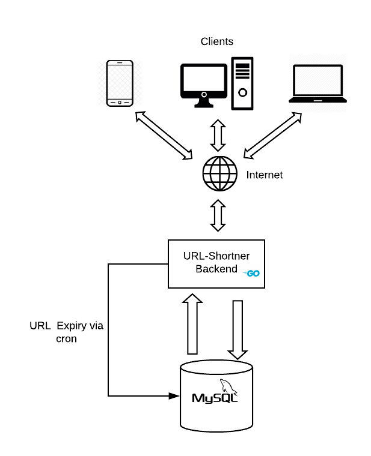

# URL-Shortner
This is a Url Shortening Web Service similar to the likes of [bit.ly](https://bit.ly), [tinyurl.com](https://tinyurl.com/) or [goo.gl](https://goo.gl) albeit highly simplified

Features include
1. An API to shorten a long URL into a smaller unique URL or alias.
2. Redirection to the original long URL if the short url is accessed.
3. Automatic Expiration and Deletion of old URLs once expiration time is reached.
4. Fairly scalable backend that can shorten thousands of Long URLs a second (documented in perf test).

## Installation and Getting Started

Clone this repo to your ``$GOPATH/src`` on your local machine using 
```bash
git clone https://github.com/gkeesh7/url-shortner.git
``` 

#### Package management
The project uses [Glide](https://glide.sh/) for Package Management.

Please follow the link in order install and configure glide for your system

After you're done installing Glide execute the glide up command to get the required packages once you're in the url-shortner directory 

```bash
glide up
```
#### Database Schema Creation
The application uses a [Mysql](https://dev.mysql.com/downloads/installer/) based Persistent Data Store and connects to it once booting up. 

It's hence necessary that mysql is running on your machine and the corresponding Table schema is pre-existing in your Database.

Please follow the link in order install and configure MYSQL for your system

Execute the following SQL script in your Mysql shell in order to create the necessary schema 

```mysql
CREATE DATABASE url_shortner;

USE url_shortner;

DROP TABLE IF EXISTS `redirection`;

CREATE TABLE `redirection`
(
    `id`         INT(11)       NOT NULL AUTO_INCREMENT,
    `url_id`     varchar(20)   NOT NULL UNIQUE,
    `url`        varchar(1024) NOT NULL,
    `created_at` TIMESTAMP     NOT NULL DEFAULT CURRENT_TIMESTAMP,
    `updated_at` TIMESTAMP     NOT NULL DEFAULT CURRENT_TIMESTAMP,
    `expiry`     TIMESTAMP     NULL     DEFAULT NULL,
    PRIMARY KEY (`id`)
);


DROP TABLE IF EXISTS `url_stats`;

CREATE TABLE `url_stats`
(
    `id`         INT(11)     NOT NULL AUTO_INCREMENT,
    `url_id`     varchar(20) NOT NULL,
    `count`      INT(11)     NOT NULL,
    `created_at` TIMESTAMP   NOT NULL DEFAULT CURRENT_TIMESTAMP,
    `updated_at` TIMESTAMP   NOT NULL DEFAULT CURRENT_TIMESTAMP,
    PRIMARY KEY (`id`)
);

INSERT INTO `redirection` (`id`, `url_id`, `url`, `created_at`, `updated_at`, `expiry`) VALUES ('1', 'test', 'https://youtu.be/dQw4w9WgXcQ?t=43', '2020-01-08 14:05:37', '2020-01-08 14:05:37', '2030-01-19 14:05:37');
```
The above SQL script can also be found in the resources package for reference 
`resources/sql_scripts/url_shortner.sql`

In case you need to configure DSN for your local MYSQL installation. 

Please do remember to make changes into
`config/database/gorm.go`

The default DSN given is 
``"root:@tcp(localhost:3306)/url_shortner?parseTime=true"``

The DSN pattern is 
``"username:password@tcp(localhost:3306)/database_name?parseTime=true"``

####  Running the Web Service
Since the Service is written in [Golang](https://golang.org/), Please make sure your ``GOPATH,GOROOT`` variables are configured properly 

Follow the link above to install and configure Golang for your system

Execute the following commands from the project directory to run the web service Backend on your system

```bash
go build main.go
./main ulimit -n 120000
```

Once the service starts running 

try visiting ``http://0.0.0.0:8080/redirect/test``

Thank me Later :)

NOTE:- If you are facing issues in configuration of ulimit for your MacOS please follow [this](http://blog.mact.me/2014/10/22/yosemite-upgrade-changes-open-file-limit) guideline  

#### Unit Testing and Perf Testing
For unit testing you can run the go test command and get the test coverage for the project 

```bash
go test ./... -cover
```
As we can see that the logic and and utils are fairly well covered with unit Test Cases 


For running a perf test you can execute the following go test command when the Service is running and it would execute a sample stress test on the running web service
```bash
go test resources/perftest/perf_test.go -v
```

As we can see that the backend took 0.5 seconds to shorten 1000 URLs 


You can tinker around with the given perf test which doesn't use any Performance testing framework, just plain Golang concurrency primitives 

## Rest APIs
The following are rest APIs that the service provides


To redirect from the shortened url_id to actual long URL 
```bash
curl -X GET \
  http://localhost:8080/redirect/{url_id} \
  -H 'cache-control: no-cache' 
``` 

To shorten a URL 
```bash
curl -X POST \
  http://localhost:8080/shorten \
  -H 'cache-control: no-cache' \
  -H 'content-type: application/json' \
  -d '{
	"url":"https://www.google.com/search?q=do+a+barrel+roll",
	"request_id":"asdlfjhlaksdjffsajkflkjghjasfflkg"
}'
```
The JSON response format for the above Curl would  be like
```json
{
    "request_id": "asdlfjhlaksdjffsajkflkjghjasfflkg",
    "short_url": "http://0.0.0.0:8080/redirect/POnv0XFu9P",
    "redirect_url": "https://www.google.com/search?q=do+a+barrel+roll",
    "expiry": "2020-01-12T19:45:51.295175+05:30"
}
```

By Default all links expire 24 hours from creation time but, if you want a custom expiry time you can provide that as well with an additional ``expiry`` field of Date type in the json

```bash
curl -X POST \
  http://localhost:8080/shorten \
  -H 'cache-control: no-cache' \
  -H 'content-type: application/json' \
  -d '{
	"url":"https://www.google.com/search?q=do+a+barrel+roll",
	"request_id":"asdlfjhlaksdjffsajkflkjghjasfflkg",
        "expiry": "2020-01-12T19:45:51.295175+05:30"
}'
```


To get URL opening stats (top 10 most frequently visited URLs in the last 24 hours in descending order)
````bash
curl -X GET \
  http://localhost:8080/stats \
  -H 'cache-control: no-cache' 
````

The JSON response format for the above Curl would be like
```json
{
    "message": "The most frequent URL clicks/redirects in last 24 hours",
    "url_stats": [
        {
            "url": "http://0.0.0.0:8080/redirect/POnv0XFu9P",
            "count": 4
        },
        {
            "url": "http://0.0.0.0:8080/redirect/vYyVeiUtUd",
            "count": 3
        },
        {
            "url": "http://0.0.0.0:8080/redirect/test",
            "count": 1
        }
    ]
}
```

## Design
#### Overview
1. The overall backend design is fairly simple we have a Golang based backend running an http server.
2. The backend connects to a persistent storage in our case MYSQL where all CRUD operations happen.
3. The URL expiry logic is handled by a cron which resides along with the application backend and runs periodically.

#### Architecture diagram



#### Design choices and justifications
##### Influencing factors for taking these design decisions are 
1. The requirements for scale (shortening thousands of URLs in a second).
2. The requirement for providing statistics on URL visits (extrapolated this to more complex analytical requirements in the future).
3. Implementation of an expiration logic to expire URLs.
4. Developer familiarity.
5. Time constraint (As this is a weekend project :) 

##### Why Golang was used as the Backend Language ?
1. Highly scalable.
2. Less amount of boiler plate code.
3. Inbuilt concurrency primitives such as go routines and channels.
4. Inbuilt monitoring and profiling tools like pprof (which has been integrated to provide cpu,memory metrics etc.)

##### Why Database was chosen to be MYSQL ?
1. Relational Database.
2. Can perform joins etc if any complex statistical or analytical requirements and use-cases come up.
3. Fairly scalable.

##### Why use Cron for expiry ?
1. Automated and Periodic in nature.
2. Fire and forget.

## Contributing
Pull requests are welcome for a few features that are in the TODO pipeline 
1. Addition of Cache to reduce redirection search time
2. Implementation of a distributed lock before execution of delete queries by Cron.
3. Addition of metrics using graphite etc.
4. Making the Backend more configurable.


## License
[MIT](https://choosealicense.com/licenses/mit/)